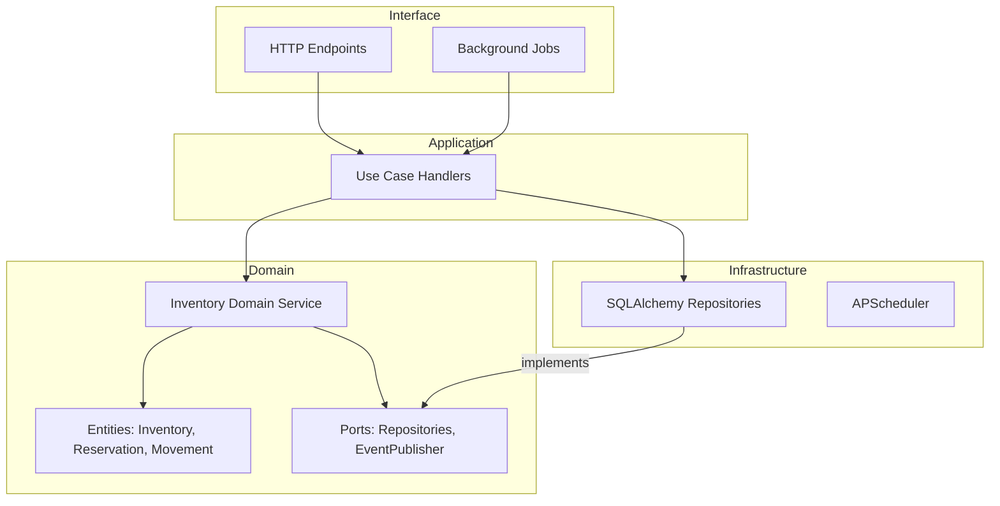
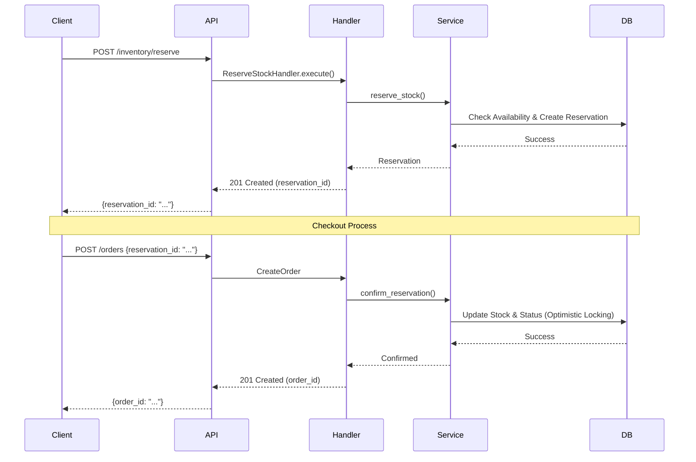

# FastAPI Example API

API de ejemplo con CRUD de Productos y Ordenes usando SQLite.

## Requisitos

- Python 3.10+

## Instalación

```bash
pip install -r requirements.txt
## Inventory Reservation System

The system implements a robust inventory management with temporary reservations, real-time stock control, and overselling prevention using optimistic locking.

### Architecture (DDD + Hexagonal)



### Reservation Flow



### Database Migrations & Seeding

The project uses **Alembic** for database migrations.

#### Run Migrations
```bash
alembic upgrade head
```

#### Seed Initial Data
```bash
python3 scripts/seed_inventory.py
```

### Key Features

- **Temporary Reservations**: Stock is reserved for 15 minutes when added to cart.
- **Optimistic Locking**: Prevents race conditions during concurrent updates.
- **Audit Log**: Every stock movement is recorded.
- **Background Jobs**: Automatic release of expired reservations and low stock detection.

### Inventory Endpoints

| Method | Endpoint | Description |
|--------|----------|-------------|
| POST | /inventory/reserve | Reserve stock for a product |
| POST | /inventory/reserve/{id}/confirm | Confirm an existing reservation |
| DELETE | /inventory/reserve/{id} | Release a reservation |
| GET | /inventory/product/{id} | Get inventory status for a product |
| POST | /inventory/restock | Add stock to a product (Admin) |
| POST | /inventory/adjust | Manually adjust stock (Admin) |
| GET | /inventory/movements | Get stock movement history |
| GET | /inventory/low-stock | List products with low stock |

### Order Integration Flow

1. **Reserve Stock**: Call `POST /inventory/reserve` to get a `reservation_id`.
2. **Create Order**: Call `POST /orders` including the `reservation_id`.
3. **Confirmation**: The system confirms the reservation, converting it to a sale.

### Background Jobs

- `release_expired_reservations_job`: Runs every 5 minutes to release active reservations that have passed their `expires_at` time.
- `check_low_stock_job`: Runs every hour to log products below their reorder point.

## Ejecutar

```bash
uvicorn app.main:app --reload
```

La API estará disponible en http://localhost:8000

## Documentación

- Swagger UI: http://localhost:8000/docs
- ReDoc: http://localhost:8000/redoc

## Endpoints

### Productos

| Método | Endpoint | Descripción |
|--------|----------|-------------|
| GET | /products | Listar productos |
| GET | /products/{id} | Obtener producto |
| POST | /products | Crear producto |
| PUT | /products/{id} | Actualizar producto |
| DELETE | /products/{id} | Eliminar producto |

### Ordenes

| Método | Endpoint | Descripción |
|--------|----------|-------------|
| GET | /orders | Listar ordenes |
| GET | /orders/{id} | Obtener orden |
| POST | /orders | Crear orden |
| PUT | /orders/{id} | Actualizar orden |
| DELETE | /orders/{id} | Eliminar orden |

## Ejemplo de uso

### Crear un producto

```bash
curl -X POST http://localhost:8000/products \
  -H "Content-Type: application/json" \
  -d '{"name": "Laptop", "description": "Laptop gaming", "price": 999.99, "stock": 10}'
```

### Crear una orden

```bash
curl -X POST http://localhost:8000/orders \
  -H "Content-Type: application/json" \
  -d '{"customer_name": "Juan", "customer_email": "juan@example.com", "items": [{"product_id": 1, "quantity": 2}]}'
```
