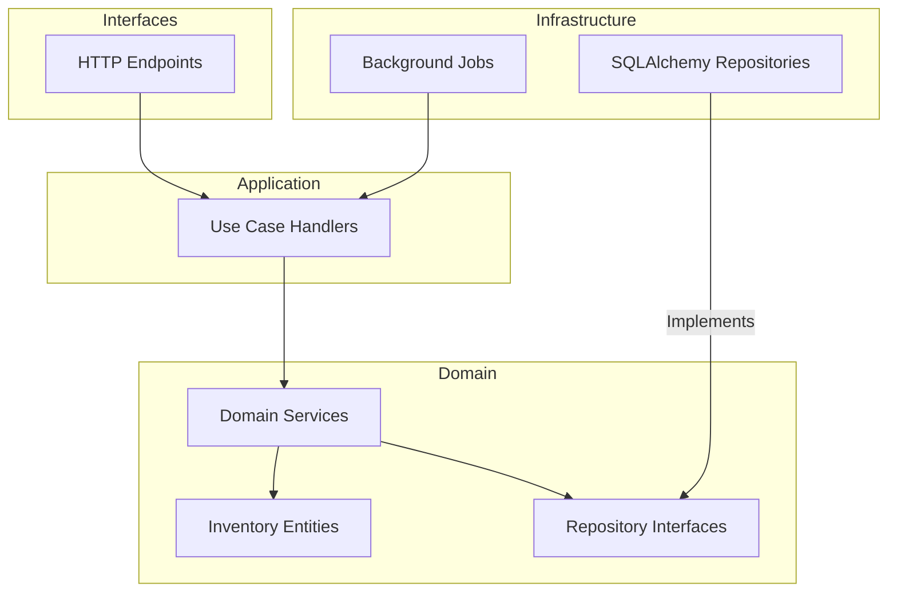

# FastAPI Example API with Inventory System

API de ejemplo con CRUD de Productos, Ordenes y un robusto sistema de Gestión de Inventario con Reservas.

## Características del Sistema de Inventario

- **Reservas Temporales**: Bloqueo de stock por 15 minutos para carritos de compra.
- **Control de Concurrencia**: Uso de Optimistic Locking (`version` field) para prevenir overselling.
- **Auditoría**: Registro completo de movimientos de stock (`StockMovement`).
- **Jobs en Segundo Plano**: Liberación automática de reservas expiradas y detección de stock bajo.
- **Arquitectura Hexagonal (DDD)**: Separación clara de responsabilidades entre dominio, aplicación e infraestructura.

## Arquitectura



## Endpoints de Inventario

| Método | Endpoint | Descripción |
|--------|----------|-------------|
| POST | `/inventory/reserve` | Reservar stock (carrito) |
| POST | `/inventory/reserve/{id}/confirm` | Confirmar reserva |
| DELETE | `/inventory/reserve/{id}` | Liberar reserva manual |
| GET | `/inventory/product/{id}` | Consultar disponibilidad |
| POST | `/inventory/restock` | Reponer stock (admin) |
| POST | `/inventory/adjust` | Ajuste manual (admin) |
| GET | `/inventory/movements` | Historial de movimientos |
| GET | `/inventory/low-stock` | Productos con stock bajo |

## Flujo de Reserva y Compra

1. **Reservar**: El usuario agrega al carrito.
   ```bash
   curl -X POST http://localhost:8000/inventory/reserve \
     -d '{"product_id": 1, "quantity": 2}'
   ```
   Retorna un `reservation_id`.

2. **Crear Orden**: El usuario completa el checkout enviando el `reservation_id`.
   ```bash
   curl -X POST http://localhost:8000/orders \
     -d '{"customer_name": "Juan", "items": [...], "reservation_id": "UUID"}'
   ```
   El sistema confirma la reserva y crea la orden en una transacción atómica.

3. **Expiración**: Si no se crea la orden en 15 minutos, un job libera el stock automáticamente.

## Instalación y Uso

### 1. Requisitos
- Python 3.10+

### 2. Instalación
```bash
pip install -r requirements.txt
```

### 3. Migraciones y Seed
```bash
# Ejecutar migraciones
alembic upgrade head

# Poblar base de datos inicial
python scripts/seed_inventory.py
```

### 4. Ejecutar
```bash
uvicorn app.main:app --reload
```

## Documentación API

- Swagger UI: http://localhost:8000/docs
- ReDoc: http://localhost:8000/redoc
